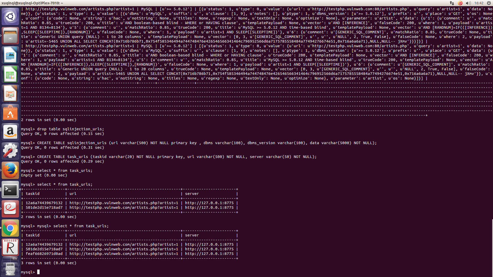

###自动化检测

####基本思路

#####SQL注入漏洞

借助sqlmap进行检测，采用sqlmapapi服务进行批量测试

达到的效果：

从爬虫爬取的数据库(table名称：result_urls)中取出url，对这些url进行检测

检测结果写入数据库(table名称：sqlinjection_urls)

可以支持多个sqlmapapi同时检测，以提高效率

####程序设计思路

程序主要由几个部分构成：获取url建立任务，监控任务执行情况，将任务执行结果写入数据库

#####获取url建立任务

连接数据库，从数据库中得到爬虫爬到的url数据。

从多个sqlmapapi服务器中选择一个任务量最小的服务器，提交检测任务

#####监控任务执行情况

为每一个服务器开启一个线程，该线程定时读取该服务器上的任务列表，将已完成的任务加入已完成列表

#####将任务结果写入数据库

开启一个线程监控已完成列表，获取已完成的任务的相关信息，存入数据库，并删除任务

>运行结果
>

###数据库信息

db : crawl

user : root

passwd : 000000

start_urls:
url

result_urls : 
domain url

sqlinjection_urls:
url(主键) dbms dbms_version data

task_urls:
url server taskid(主键)